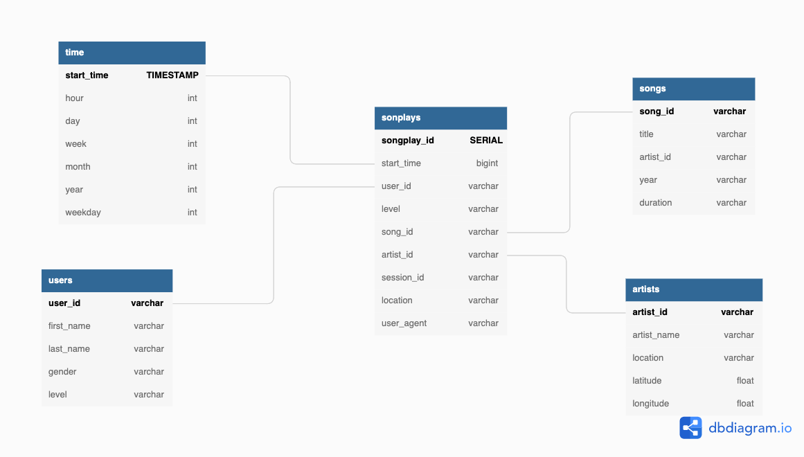

# Project 1: Data Modeling with Postgres

## Intro
A startup called Sparkify wants to analyze the data they've been collecting on songs and user activity on their new music streaming app. The analytics team is particularly interested in understanding what songs users are listening to

## Model

## Data
Data is currently captured in two directories
data/log_date
data/song_data

### Log Data
`{
 "artist":null
"auth":"LoggedIn"
"firstName":"Walter"
"gender":"M"
"itemInSession":0
"lastName":"Frye"
"length":null
"level":"free"
"location":"San Francisco-Oakland-Hayward, CA"
"method":"GET"
"page":"Home"
"registration":1540919166796.0
"sessionId":38
"song":null
"status":200
"ts":1541105830796
"userAgent":"\"Mozilla\/5.0 (Macintosh; Intel Mac OS X 10_9_4) AppleWebKit\/537.36 (KHTML, like Gecko) Chrome\/36.0.1985.143 Safari\/537.36\"","userId":"39"
}`

### Song Data
`{
num_songs:1
artist_id:"ARD7TVE1187B99BFB1"
artist_latitude:null
artist_longitude:null
artist_location:"California - LA"
artist_name:"Casual"
song_id:"SOMZWCG12A8C13C480"
title:"I Didn't Mean To"
duration:218.93179
year:0
}`

## Methodology 
The company's main objective is to understand what songs users are listening too so we need to create a model that has a fact table of songplays with users, artists, and songs all serving to support this type of analysis. 

### Connection to DB
`conn = psycopg2.connect("host=127.0.0.1 dbname=sparkifydb user=student password=student")
cur = conn.cursor()
conn.set_session(autocommit=True)`
Note: `conn.set_session(autocommit=True)` ensures that we do not need to commit the session for every action in the notebook.

### Creation of databases
`!python create_tables.py` 
run this script to drop and recreate the tables before running any tests in the notebook

### populate tables with data
`! python etl.py`
